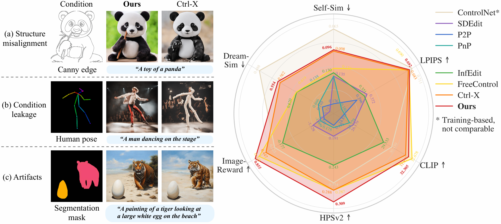
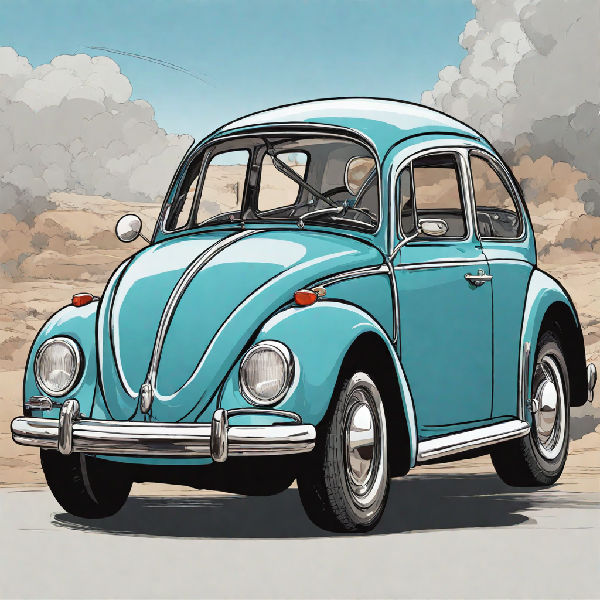

# RichControl: Structure- and Appearance-Rich Training-Free Spatial Control for Text-to-Image Generation

<a href="https://zhang-liheng.github.io/richcontrol"></a> <a href="https://youtu.be/yBESOlbruWU"></a> <a href="https://arxiv.org/abs/2507.02792"></a>

[Liheng Zhang](https://github.com/zhang-liheng/)<sup>\*</sup>, [Lexi Pang](https://github.com/LexiPang)<sup>\*</sup>, [Hang Ye](https://alvinyh.github.io/), [Xiaoxuan Ma](https://shirleymaxx.github.io/), [Yizhou Wang](https://cfcs.pku.edu.cn/english/people/faculty/yizhouwang/index.htm)<br>
Peking University<br>
<sup>*</sup>Equal contribution <br>



## Environment setup

After cloning this repository, run

```
conda env create -f environment.yml
conda activate richcontrol
```

## Example

For example image generation, run

```
python run_richcontrol.py
```

After that, in the directory `results` you should get something like



Feel free to add various images and create your own prompts for controllable generation!

Image input format can be found in `configs/image_config.yaml`.

Model configurations can be found in `configs/model_config.yaml`. Note that the Appearance-Rich Prompting module is disabled in the default config. Please update the configurations if you would like to use a prompt model.

## Dataset

To download our dataset, click [here](https://drive.google.com/file/d/1ejDgx7DL-B4x-igQMv5lt8-XXD0eHuTG/view?usp=sharing). As described in the paper, the dataset comprises 150 image-prompt pairs spanning 7 condition types ("canny edge", "depth map", "HED edge", "normal map", "scribble drawing", "human pose", "segmentation mask") and 7 semantic categories ("animals": 58, "humans": 26, "objects": 20, "buildings": 16, "vehicles": 12, "scenes": 10, "rooms": 8).
The dataset is organized as follows:

```
images
  canny
    beetle_canny
      condition.png
    cat_cartoon
      condition.png
    ...
  depth
    bedroom_depth
      condition.png
    castle_cartoon
      condition.png
    ...
  hed
    ...
  normal
    ...
  pose
    ...
  scribble
    ...
  seg
    ...
  image_config_dataset.yaml
```

For clarity, we split the entire dataset into 7 folders corresponding to 7 condition types. The file `data_prompt-driven.yaml` contains all metadata used in our evaluation experiments, where each entry includes the image file path, an inversion prompt, and a generation prompt:

```yaml
- condition_image: canny/beetle_canny/condition.png
  inversion_prompt: a canny edge map of a volkswagen beetle
  prompt: a cartoon of a volkswagen beetle
- ...
...
```

Although our method does not require DDIM inversion, we include the `inversion_prompt` field to facilitate comparisons with baseline methods that rely on DDIM inversion.
Our dataset is based on datasets from prior work including [Ctrl-X](https://github.com/genforce/ctrl-x), [FreeControl](https://github.com/genforce/freecontrol), [Plug-and-Play](https://github.com/MichalGeyer/pnp-diffusers), and [ADE20K](https://ade20k.csail.mit.edu/). We gratefully acknowledge their contributions to the community.

## Contact

For any questions and discussions, please contact [Liheng Zhang](https://github.com/zhang-liheng) (zhangliheng@stu.pku.edu.cn).

## Acknowledgement

Our code is inspired by repositories including [Ctrl-X](https://github.com/genforce/ctrl-x), [Plug-and-Play](https://github.com/MichalGeyer/pnp-diffusers) and [Restart sampling](https://github.com/Newbeeer/diffusion_restart_sampling). We thank their contributors for sharing the valuable resources with the community.

## Reference

If you use our code in your research, please cite the following work.

```bibtex

@misc{zhang2025richcontrolstructureappearancerichtrainingfree,
      title={RichControl: Structure- and Appearance-Rich Training-Free Spatial Control for Text-to-Image Generation}, 
      author={Liheng Zhang and Lexi Pang and Hang Ye and Xiaoxuan Ma and Yizhou Wang},
      year={2025},
      eprint={2507.02792},
      archivePrefix={arXiv},
      primaryClass={cs.CV},
      url={https://arxiv.org/abs/2507.02792}, 
}

```
